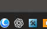
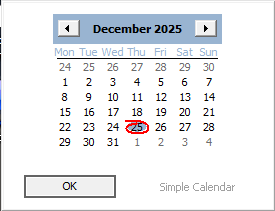

# CalendarReplacer
 

## Installation ##

Extract the Calendar.rar to a folder then
Execute it Will add a simple calendar to left click on clock. 

Then a icon will appear near the clock

Left Click the time and a simple clock will appear

will be adding more features to the calendar in 2026 ....

Check you have downloaded the latest version if there are any issues <a href="mailto:legionslost@proton.me?subject=urltofile">legionslost@proton.me</a> 
or you can support me via 

